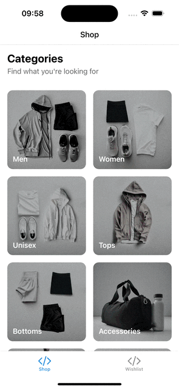

# ⚡️ Turbo Shop

Turbo Shop is a mock e-commerce mobile application built with [Expo](https://docs.expo.dev/) and [Expo Router](https://docs.expo.dev/router/introduction/), using Shopify's [mock.shop API](https://mock.shop/) as a backend.

This app was created as a demo for my talk, [Turbocharging React Native Performance ⚡️](./slides.pdf) and serves as a showcase for collecting performance metrics using [Flashlight](https://flashlight.dev/) and [maestro](https://maestro.dev/) CLI.

[Presentation slides](./slides.pdf) 🔗



## 🛠️ Getting Started

Install dependencies

```
npm install
```

Launch the bundler

```
npm run start
```

Collect performance scores using Flashlight:

```
npm run performance
```

## 📄 License

This project is licensed under the [MIT License](./LICENSE).
